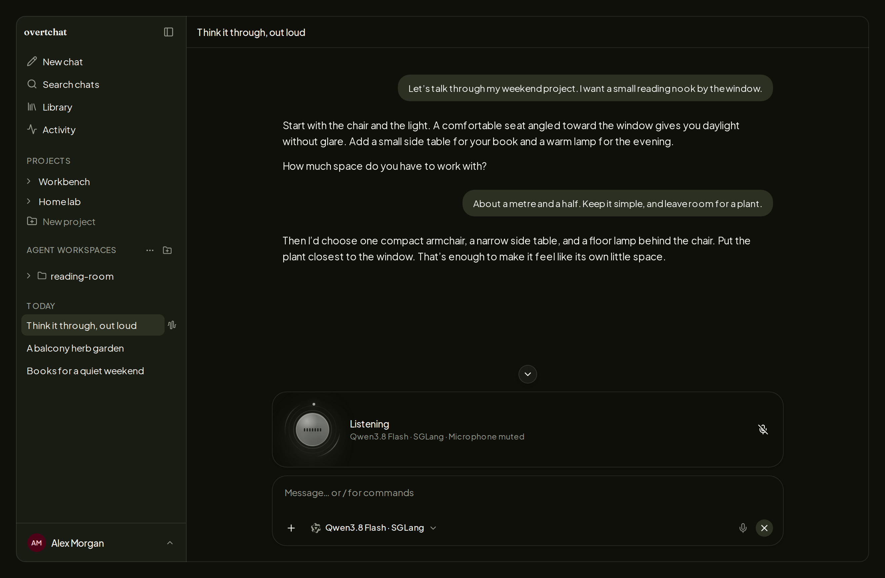
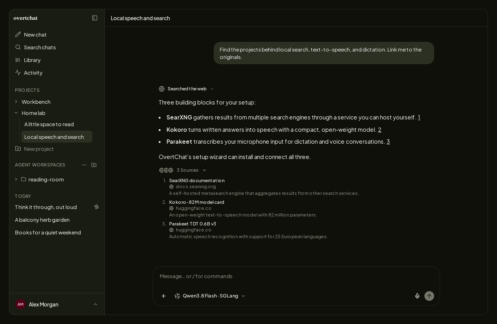
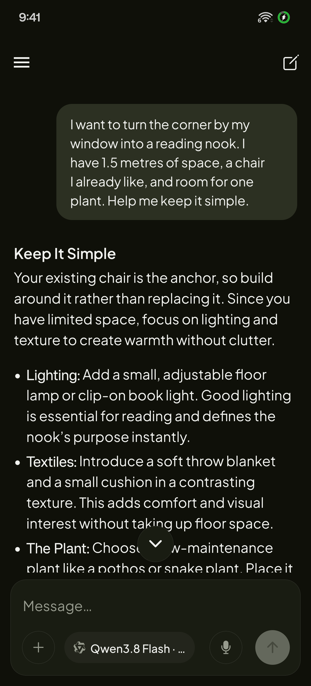
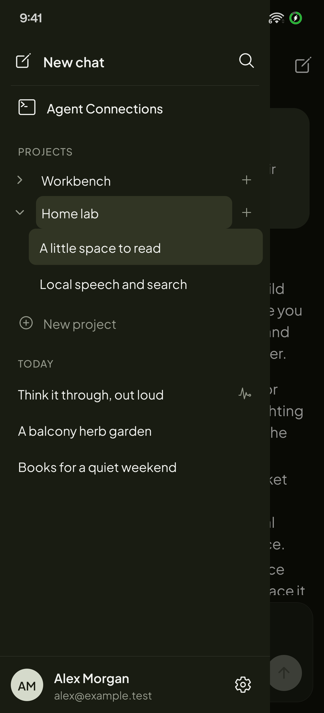

<p align="center">
  <picture>
    
  </picture>
</p>

<p align="center"><strong>Local AI, without the clutter.</strong></p>
<p align="center">Your models. Your conversations. A cleaner place to think.</p>

<p align="center">
  <a href="https://github.com/yoloyash/overtchat/releases"></a>
  <a href="LICENSE"></a>
  <a href="https://play.google.com/store/apps/details?id=com.overtchat.mobile"></a>
</p>

<p align="center">
  <a href="https://overtchat.com/">Website</a> ·
  <a href="#quick-start">Get started</a> ·
  <a href="docs/deploy.md">Documentation</a> ·
  <a href="docs/comparison.md">Compare alternatives</a>
</p>

<picture>
  
</picture>

OvertChat is a self-hosted home for everyday AI. Connect **vLLM, llama.cpp,
or SGLang**, bring a hosted provider when you want one, and get straight to
chatting. Search the web, work with files, or talk things through by voice—all
in the same interface, with your history on your server. Give your family
accounts to use the same local models with their own conversations.

## Quick start

On an **x86-64 or arm64 Linux** server:

```sh
curl -fsSL https://overtchat.com/install | sh
```

The guided installer handles Docker, configuration, and secrets. Choose the
local search and speech services you want, open the printed URL, and create
your account. The first signup becomes the administrator. Add your model
endpoint in the app; OvertChat connects to inference servers you already run.
With a local model and the bundled speech and search services, **no provider
API keys or paid credits are needed to get started**.

```sh
overtchat setup     # add services or change the installation
overtchat status    # check the app and its services
overtchat update    # update the managed installation
```

[Installation, existing Compose adoption, backups, and troubleshooting →](docs/deploy.md)

## The useful parts, together

- **A conversation you can focus on.** Readable answers, collapsible reasoning
  and tool activity, projects, reusable files, and searchable history. Light
  and dark themes, with the same chat experience on a narrow screen.
- **Local models feel at home.** Dedicated setup and model discovery for vLLM,
  llama.cpp, and SGLang. Hosted providers and custom compatible endpoints fit
  alongside them.
- **Bundled speech and search. Zero API keys.** Select SearXNG search,
  Kokoro text-to-speech, and Parakeet speech-to-text in the installer; it
  installs and connects them for you. With your local model, no provider
  accounts or API keys are needed. Search includes free fallbacks if the
  primary provider fails. You can also use your own compatible speech services.
- **A server you own.** Keep your conversations on your server, choose who
  gets access, and manage your own backups. No OvertChat cloud account or
  usage analytics.
- **One setup for the household.** Add accounts for your family and share your
  local models. Each person gets their own chats and projects on web and Android.
  [Set up family access.](docs/deploy.md#share-with-your-family)

## Talk it through

Start a **two-way voice conversation** in your browser. Speak naturally, hear
the answer, interrupt to redirect it, and come back to the saved transcript.
Voice can use web search and the selected chat model; it does not require a
hosted realtime model subscription.

Enable realtime voice with `overtchat setup` after configuring STT and TTS.
Keep the model and both speech services local for local voice processing.
Microphone access needs HTTPS outside localhost.

<picture>
  
</picture>

## Search with a backup plan

Answers can search the web, read pages, and cite their sources. Enabled search
tries configured **Brave → SearXNG**, then keyless **Firecrawl → Exa →
DuckDuckGo** fallbacks when needed. A failed primary provider need not end the
search. Keyless access is subject to upstream availability and rate limits;
search queries go to the providers used.

<details>
<summary>See search and sources</summary>

<picture>
  
</picture>

</details>

## Take your conversations with you

Use the responsive web app or connect the **native Android app** to your own
server. Your chats, projects, files, and Agent Connections come with you.

[Get it on Google Play](https://play.google.com/store/apps/details?id=com.overtchat.mobile)
· [Install an APK](docs/deploy.md#sideload-an-apk)

<p align="center">
  
  
</p>

<sub>OvertChat for Android. Same server, same conversations.</sub>

## Coding agents, when you need them

Connect **Codex, Claude Code, Pi, Oh My Pi, or OpenCode** through the Host
Connector. Start or resume sessions, follow plans and tool calls, review
changes, and respond to approvals from OvertChat. Agents run on your own
machine or an SSH host, with that host's tools and credentials.

<details>
<summary>See Agent Connections</summary>

<picture>
  
</picture>

</details>

## Why OvertChat?

Choose OvertChat if you want a focused local AI interface with search, speech,
and voice brought together by a guided installer.

| Your priority | What OvertChat offers |
| --- | --- |
| Speech and search ready at setup | Bundled STT, TTS, and SearXNG, with no provider API keys needed |
| Search that can recover from provider failures | Automatic fallbacks, including free providers without API keys |
| Control over your data | Choose your providers, keep your chat history, and manage access and backups |
| Freedom to adapt the product | MIT permission to modify, redistribute, and rebrand the app |
| Local AI for the family | Shared models with separate accounts, conversations, and projects |

[Compare OvertChat, Open WebUI, and LibreChat →](docs/comparison.md)

## Contribute and learn more

[Development setup](docs/development.md) ·
[Android installation](docs/deploy.md#android) ·
[Release process](docs/release.md) ·
[README media](docs/readme-media.md) ·
[Privacy policy](https://overtchat.com/privacy/) ·
[Report an issue](https://github.com/yoloyash/overtchat/issues)

## License

[MIT](LICENSE). Use, modify, redistribute, and rebrand OvertChat while retaining
the copyright and license notice. Bundled third-party software and models keep
their own licenses.
