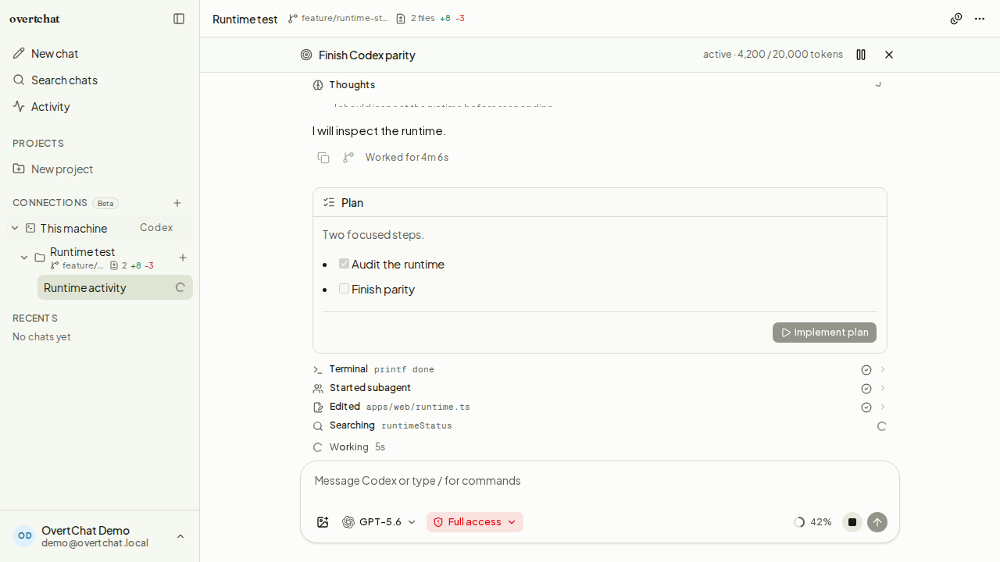
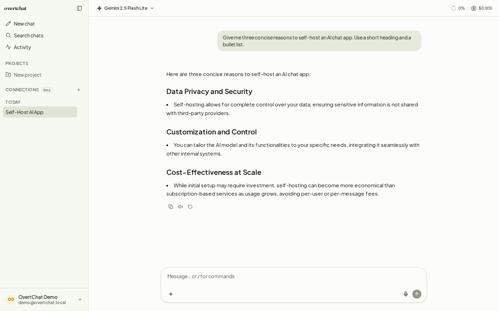

<p align="center">
  
</p>

<p align="center">
  <strong>Self-hosted AI chat and coding agents, in one place.</strong>
</p>

<p align="center">
  Chat with hosted or local models, then launch and control Codex, Pi, and Oh My Pi
  on this server or over SSH—all from the same web app. OvertChat is a fast,
  private alternative to Open WebUI that installs and updates with one command.
</p>

<p align="center">
  <a href="https://overtchat.com/"></a>&nbsp; • &nbsp;
  <a href="https://github.com/yoloyash/overtchat/releases"></a>&nbsp; • &nbsp;
  <a href="https://play.google.com/store/apps/details?id=com.overtchat.mobile"></a>&nbsp; • &nbsp;
  <a href="https://overtchat.com/privacy/"></a>&nbsp; • &nbsp;
  <a href=".github/actions/repo-tokens/README.md"></a>
</p>

<p align="center">
  <strong>Coding agents · Web (Beta)</strong>
</p>

<p align="center">
  
</p>

## Quick start

```bash
curl -fsSL https://overtchat.com/install | sh
```

The guided setup detects Docker, offers to install it when missing, generates
the secrets and Compose configuration, and lets you choose web search,
text-to-speech, speech-to-text, and Agent Connections. Open the URL it prints;
the first signup becomes the admin.

- Re-run `overtchat setup` to add or change optional services.
- Run `overtchat status` to inspect the managed installation.
- Run `overtchat update` to update OvertChat, selected sidecars, database
  migrations, and the managed Agent Connector together.
- Existing standard Docker Compose installations can be adopted in place
  without replacing their data volume or bind mount.

Prefer to manage Compose yourself or deploy from source? The manual flow
remains supported in the [deployment guide](docs/deploy.md#manual-compose-installation).

## One interface, two workflows

| | AI chat | Coding agents |
| --- | --- | --- |
| **What it connects to** | OpenAI, Anthropic, Gemini, DeepSeek, Bedrock, vLLM, llama.cpp, SGLang, and custom endpoints | Codex, Pi, and Oh My Pi installed on your machines |
| **Where it runs** | Web and native Android | Web app (Beta) |
| **What stays with you** | Accounts, chat history, files, and search index | Source code, agent sessions, credentials, tools, configs, and skills |
| **Remote access** | Connect to the OvertChat server you host | Run agents on the OvertChat host or machines from your SSH config |

### AI chat

Use OvertChat as a complete chat client for hosted APIs and models running on
your own hardware:

<p align="center">
  <strong>AI chat · Web</strong>
</p>

<p align="center">
  
</p>

- Streaming replies that survive a browser reload
- Persistent, editable, automatically titled chat history
- SQLite FTS5 full-text search across past conversations
- Projects with per-project system prompts
- Images, PDFs, Word, Excel, CSV, and source-code attachments
- Web search with citations through bundled SearXNG—no search API key
- Bundled text-to-speech and optional local speech-to-text
- Chat export as JSON or Markdown

### Coding agents (Beta)

Use the same web app to work with the coding agents already installed and
authenticated on your machines:

- Connect Codex, Pi, and Oh My Pi on the OvertChat host or an SSH host
- Start new sessions or resume native agent sessions in an attached workspace
- See plans, reasoning, terminal commands, edits, tool calls, and subagent work
  as they happen
- Follow Git branch and working-tree changes alongside the session
- Queue follow-ups, steer an active turn, stop work, attach images, and use
  agent-native slash commands
- Use provider-specific controls such as Codex models, reasoning effort,
  permissions, Plan mode, Fast mode, forks, goals, and account usage

Choose **Agent Connections → Yes** during `overtchat setup`. The installer
provisions the host-native connector and keeps it synchronized through
`overtchat update`; there is no pairing code to copy. Existing manually paired
connectors continue to work.

The connector runs as your user, opens an outbound authenticated connection to
OvertChat, and invokes SSH targets by their existing aliases. Agent processes,
native session files, source trees, credentials, and SSH keys stay on their
machines.

## A focused alternative to Open WebUI

[Open WebUI](https://github.com/open-webui/open-webui) is an impressive project
with a much broader feature surface. OvertChat makes a different tradeoff: it
focuses on fast AI chat, coding-agent control, and a small self-hosted stack
that is easy to understand and back up.

- **Small operational footprint.** One Next.js application, one portable
  SQLite database, and a small capped Redis resume buffer. No Postgres, Celery,
  separate API service, or vector database.
- **No RAG or embeddings stack.** Chat search is SQLite FTS5 + BM25. Web search
  results go directly into model context as JSON.
- **Useful local services are already wired up.** SearXNG search, Kokoro
  text-to-speech, and optional Parakeet speech-to-text are installer choices,
  not integration projects.
- **Provider-aware without a plugin runtime.** Major hosted providers and
  common local servers have first-class presets; custom endpoints explicitly
  select Chat Completions, Responses, or Messages.
- **Portable by design.** Application data lives in a SQLite file you can copy,
  back up, inspect, or delete.

If you want image generation, a code interpreter, knowledge graphs, or a large
plugin ecosystem, Open WebUI or LibreChat may be a better fit. If you want a
responsive chat app and a browser control surface for coding agents that stays
out of your way, that is what OvertChat is built for.

## Mobile

<a href="https://play.google.com/store/apps/details?id=com.overtchat.mobile"></a>

The Android app is a thin native client for your own server—there is no
OvertChat cloud account. On first launch, enter the URL of an instance you
control. Your account, chats, and files stay on that server, and requests go to
it rather than through an OvertChat-operated service.

Mobile supports native chat with streaming replies, model selection, projects,
full-text history search, image and document uploads, web-search citations,
text-to-speech, and dictation.

- **Android:** [Google Play](https://play.google.com/store/apps/details?id=com.overtchat.mobile), or [sideload an APK](docs/android.md#sideload-apk) from any `mobile-v*` release.
- **iOS:** internal/TestFlight only; there is no App Store timeline.

## Privacy

No usage analytics and no advertising. The server sends model requests only to
endpoints you configure and sends web searches through its configured SearXNG
instance.

The Android client can send crash diagnostics to Sentry. These may include
technical request metadata; the app does not intentionally attach chat
content, attachments, or credentials. See the
[privacy policy](https://overtchat.com/privacy/) for details.

## Requirements

- Linux on x86-64 or arm64 for the managed installer
- Docker and Docker Compose v2 (the installer can install Docker on supported systems)
- About 1 GB of free RAM for the base app stack
- An LLM endpoint—hosted or self-hosted
- At least one configured agent CLI to use Agent Connections

## Stack

Next.js 16 · Vercel AI SDK v7 · Better Auth · Drizzle · SQLite · Redis ·
base-ui · Tailwind · SearXNG · Kokoro TTS · Parakeet STT

## Documentation

- [Deployment, updates, backup, and troubleshooting](docs/deploy.md)
- [Android installation](docs/android.md)

## License

MIT. Fork it, white-label it, ship it. No branding clauses to negotiate around.
